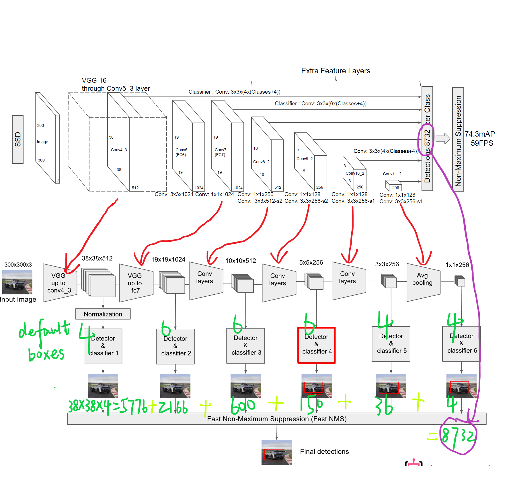

## [SSD: Single Shot MultiBox Detector](https://arxiv.org/abs/1512.02325)

### 简单叙述下SSD
SSD 是一个 one-stage 目标检测器，使用 VGG16 网络作为特征提取网络，但是将 VGG16的全连接层换成卷积层，并在后面添加自定义的卷积层(extras layer: conv 8_2, conv 9_2, conv 10_2, conv 11_2)，直接采用卷积层进行检测。在多个特征图上设置不同缩放比例和不同宽高比的先验框以融合多尺度特征图进行检测，低层的大尺度特征图可以用来捕捉小物体的信息，而高维的小尺度特征图能捕捉到大物体的信息，SSD融合高低维的特征，从而提高检测的准确性和定位的准确性。  
**SSD300简洁版**  

**SSD300手画详细版**  

### SSD模型（设计理念）
SSD与YOLOv1都采用CNN，但SSD却采用了多尺度得特征图。根据SSD论文2.1Model部分，SSD的模型设计有三点：
#### 1.采用多尺度特征图用于检测
所谓多尺度采用大小不同的特征图，CNN网络一般前面的特征图比较大，后面会逐渐采用stride=2的卷积或者pool来降低特征图大小，这正如图3所示，一个比较大的特征图和一个比较小的特征图，它们都用来做检测。这样做的好处是比较大的特征图来用来检测相对较小的目标，而小的特征图负责检测大目标，如图所示，8x8的特征图可以划分更多的格子(cell，格子，单元)，每个格子的感受野比8x8格子的感受野要小，可以检测更小的目标。  

#### 2.采用卷积进行检测
与Yolo最后采用全连接层不同，SSD直接采用卷积对不同的特征图来进行提取检测结果。对于形状为 m \* n \* p 的特征图，只需要采用 3 \* 3 \* p 这样比较小的卷积核得到检测值。 
#### 3.设置先验框
SSD借鉴了Faster R-CNN中anchor的理念，给每一个格子设置不同长宽比的先验，从低维特到高维特征图有Conv4_3，Conv7，Conv8_2，Conv9_2，Conv10_2，Conv11_2，其 size 分别是 38 \* 38 ，19 \* 19 ，10 \* 10 ，5 \* 5 ，3 \* 3 ，1 \* 1 ，但是不同特征图设置的先验框数目不同，不同层 feature map 含有的先验框数目分别为：4，6，6，6，6，4。我们设某一层 feature map 尺寸为 m \* n，先验框有 k 个。数据集类别有 c-1 个（注意SSD预测是包含背景类的），那么这一层特征图需要（c+4）\*k个卷积核，共预测 (c+4)kmn 个输出。  
对于先验框的尺度，遵循一个线性递增的规则：  
随着feature map大小减少，先验框尺度线性增加：  

**先验框的设置也可以按照图【SSD300手画详细版】的右上角式子来计算**  

### 训练时的先验框匹配策略
- 首先，寻找与每一个ground truth有最大的IoU的default box，这样就能保证ground truth至少有default box匹配；
- 将剩余还没有配对的default box与任意一个ground truth尝试配对，只要两者之间的IoU大于阈值（SSD 300 阈值为0.5），就认为match；
- 配对到ground truth的default box就是positive，没有配对的default box就是negative。  
总之，一个ground truth可能对应多个positive default box，而不再像MultiBox那样只取一个IOU最大的default box。其他的作为负样本（每个default box要么是正样本box要么是负样本box）。

###  Hard Negative Mining
一般情况下negative default boxes数量是远大于positive default boxes数量，如果随机选取样本训练会导致网络过于重视负样本（因为抽取到负样本的概率值更大一些），这会使得loss不稳定。因此需要平衡正负样本的个数，我们常用的方法就是Hard Ngative Mining，即依据confidience score对default box进行排序，挑选其中confidience高的box进行训练，将正负样本的比例控制在positive：negative=1：3，这样会取得更好的效果。如果我们不加控制的话，很可能会出现Sample到的所有样本都是负样本（即让网络从这些负样本中找正确目标，这显然是不可以的），这样就会使得网络的性能变差。  
(Faster R-CNN中是随机抽取128个正样本和128个负样本)  

#### 推荐/参考链接
- [SSD详解](https://blog.csdn.net/WZZ18191171661/article/details/79444217)
- [目标检测|SSD原理与实现](https://zhuanlan.zhihu.com/p/33544892)
- [SSD检测小目标](https://www.zhihu.com/search?type=content&q=ssd%E6%A3%80%E6%B5%8B%E5%B0%8F%E7%9B%AE%E6%A0%87)
- [目标检测之YOLO，SSD](http://lanbing510.info/2017/08/28/YOLO-SSD.html)
- [深度学习笔记（七）SSD 论文阅读笔记简化](https://www.cnblogs.com/xuanyuyt/p/7447111.html#FeedBack)

