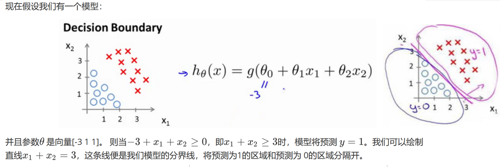

## 逻辑回归（Logistic Regression，LR）
逻辑回归（Logistic Regression）也称为"对数几率回归"，又称为"逻辑斯谛"回归。

### 知识点精简：
- 逻辑回归过程：面对一个回归或者分类问题，建立代价函数，然后通过优化方法迭代求解出最优的模型参数，然后测试验证我们这个求解的模型的好坏。
- Logistic回归虽然名字里带“回归”，但是它实际上是一种分类方法，主要用于两分类问题（即输出只有两种，分别代表两个类别）
- 回归模型中，y是一个定性变量，比如y=0或1，logistic方法主要应用于研究某些事件发生的概率。
- 逻辑回归的本质——极大似然估计
- 逻辑回归的激活函数——Sigmoid
- 逻辑回归的代价函数——交叉熵

### 逻辑回归的优缺点
- 优点： 
	- 1.速度快，适合二分类问题 
	- 2.简单易于理解，直接看到各个特征的权重 
	- 3.能容易地更新模型吸收新的数据 
- 缺点： 
	- 对数据和场景的适应能力有局限性，不如决策树算法适应性那么强

### 逻辑回归中最核心的概念是Sigmoid函数
通过函数S的作用，我们可以将输出的值限制在区间[0， 1]上，p(x)则可以用来表示概率p(y=1|x)，即当一个x发生时，y被分到1那一组的概率。我们可以选择一个阈值，通常是0.5，当y>0.5时，就将这个x归到1这一类，如果y<0.5就将x归到0这一类。但是阈值是可以调整的，比如说一个比较保守的人，可能将阈值设为0.9，也就是说有超过90%的把握，才相信这个x属于1这一类。

### Regression 常规步骤
- 1.寻找h函数（即预测函数或者说假设函数）
- 2.构造J函数（损失函数或者说代价函数）
- 3.想办法（迭代）使得J函数最小并求得回归参数（θ）

函数h(x)的值有特殊的含义，它表示结果取1的概率，于是可以看成类1的后验估计。因此对于输入x分类结果为类别1和类别0的概率分别为：   
P(y=1│x;θ)=hθ (x)   
P(y=0│x;θ)=1-hθ (x)  

### 代价函数
**逻辑回归一般使用交叉熵作为代价函数**。  
为什么要使用交叉熵函数作为代价函数，而不是线性回归里的平方误差函数？吴恩达机器学习笔记 94 页有。  


### 公式推导[NGML94]  


### 逻辑回归伪代码
```
初始化线性函数参数为1  
构造sigmoid函数  
重复循环I次  
	计算数据集梯度  
	更新线性函数参数  
确定最终的sigmoid函数  
输入训练（测试）数据集  
运用最终sigmoid函数求解分类  
```

### 通过判定边界，更好的理解逻辑回归
  
  
  

### 用逻辑回归解决多分类  
 
  

推荐/参考链接
- [吴恩达深度学习笔记](http://www.ai-start.com/ml2014/html/week3.html#header-n6)


