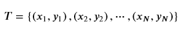
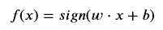

### 感知机
二分类模型，给定线性可分数据集：    
    
若存在某个超平面S: w x + b = 0 使    
数据集的正负实例完全被划分到超平面的两侧，即    
对所有yi = +1 的实例，有 w x + b > 0；    
对所有yi = -1 的实例，有 w x + b < 0    
定义符号函数：  
  
则模型为：  

**损失函数**  
若loss为误分类点的总数，则loss就不是超平面参数w,b的连续可导函数，不易优化。  
感知机的loss是误分类点到超平面S的总距离，假设平面S的误分类点集合为M，则总距离为： 
  
不考虑1/||w||，感知机损失为：  
    

  