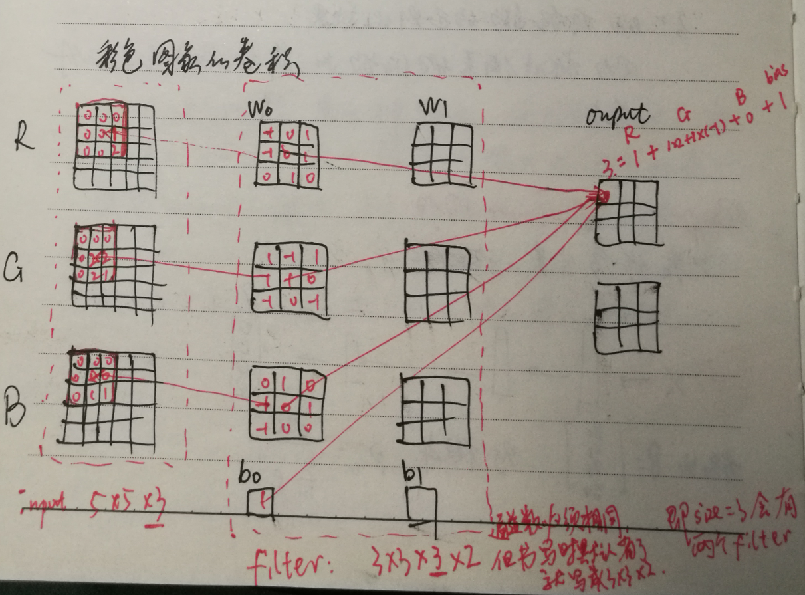
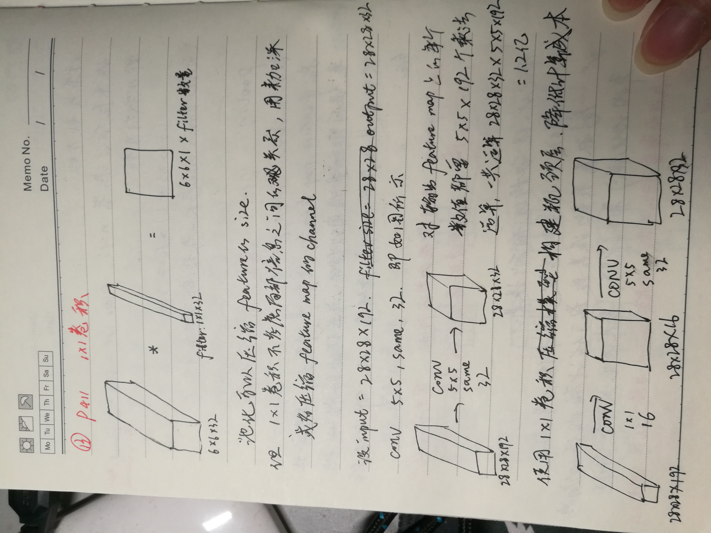
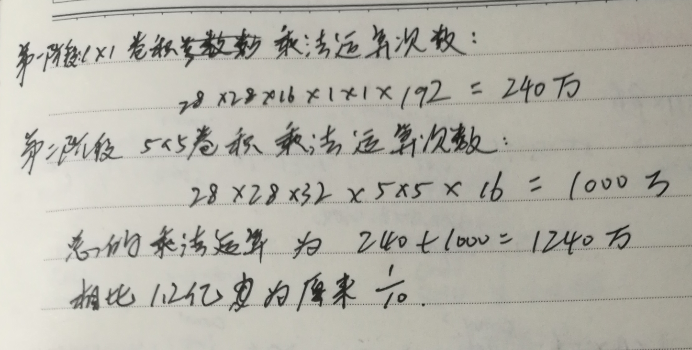

## 卷积
[HB356, 372]
### same方式卷积中padding的好处：
- 若不使用 padding，每次作卷积图像都会缩小
- 图像边缘的像素点在输出中采用较少，意味着丢掉了图像边缘像素的许多信息，使用padding使图像边缘的像素与中间
的像素采样数一样多。
### 卷积输入输出满足的计算公式
same方式下：
输出 size = (n + 2p - f)/s + 1，结果向下取整    
n: 输入尺寸，p: padding，f: 过滤器filter size，s: stride  
其实池化也满足这个公式，池化时，相当于 p=0, s=2  
valid模式下：
上式的 p=0

### 设某层有过滤器n=N，filter size = W * H * C，那么共有参数多少？
(W * H * C + 1) * N  
即卷积这种方式相比于全连接来说，参数大大减少。模型的参数不会随着输入图片的 size 变化而变化。 

### 对pooling的理解？
最大值池化：Max pooling.  
若 feature map 中的某一位值特别大，则这一位置很可能就是有用的特征（参考边缘检测过滤器输出的 feature map），保留最大值即保留特征。
- 最大池化能更好地保留纹理信息
- 平均池化（mean pooling）保留数据地整体特征，突出背景信息  
用池化提取特征有两个误差：  
- 1.领域大小受限，造成了估计值方差增大
- 2.卷积层参数误差造成了估计均值地偏移，平均池化减少了第一种误差，最大池化减少了第二种误差
池化层没有需要学习地参数，池化后 channel 与输入相同，仅改变 size  
[HB381]  

### 1 * 1 卷积核的理解

