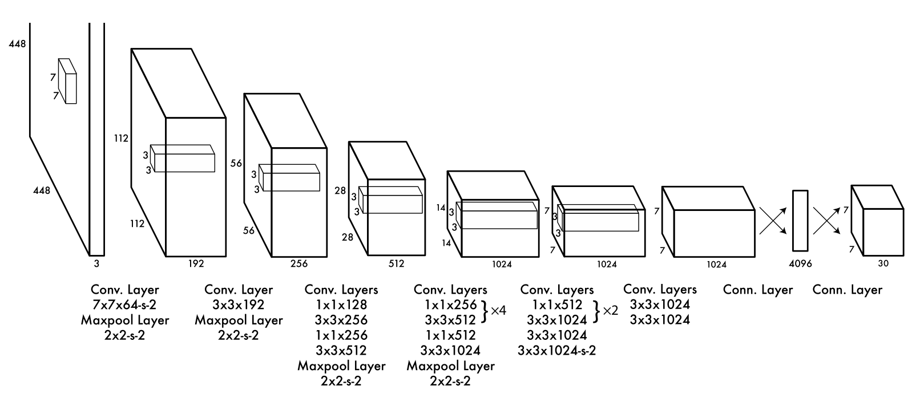

### YOLOv1: [You Only Look Once: Unified, Real-Time Object Detection](https://arxiv.org/abs/1506.02640)
YOLOv1是one-stage detection的开山之作，YOLO创造性的将物体检测任务直接当作回归问题（regression problem）来处理，将区域建议和检测两个阶段合二为一。在全图的范围作预测，很少因背景而误检。  

### 简单介绍下YOLOv1的预测过程
- 1.对一个输入图像（448\*448），首先将图像划分成S * S 的网格。
- 2.对于每个网格，预测B个包围框（每个box包含5个预测量，x, y, w, h和confidence）以及C个类别概率，总共输出S \* S \* (B * 5 + C) 个 tensor
- 3.根据上一步可以预测出S \* S \* B个目标窗口，然后根据阈值去除可能性比较低的目标窗口，再由NMS去除冗余窗口即可。
在 VOC数据集上，S=7，B=2，C=20。  
YOLOv1使用了end-to-end的回归方法，没有region proposal步骤，直接回归便完成了位置和类别的预测。由于YOLO网格设置比较稀疏，且每个网格只预测2个边界框，其总体预测精度不高，略低于Fast RCNN。其对小物体的检测效果较差，尤其是对密集的小物体表现比较差。

### 如何理解损失函数
  

#### 推荐/参考链接

- [从YOLOv1-到YOLOv3](https://blog.csdn.net/guleileo/article/details/80581858)

- [YOLO损失函数解析——你真的读懂YOLO了嘛？](https://blog.csdn.net/WenDayeye/article/details/88807190)
- [YOLO 系列损失函数理解](https://www.cnblogs.com/WSX1994/p/11226012.html)