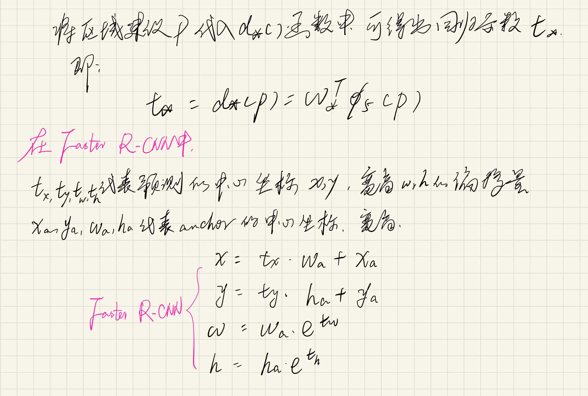
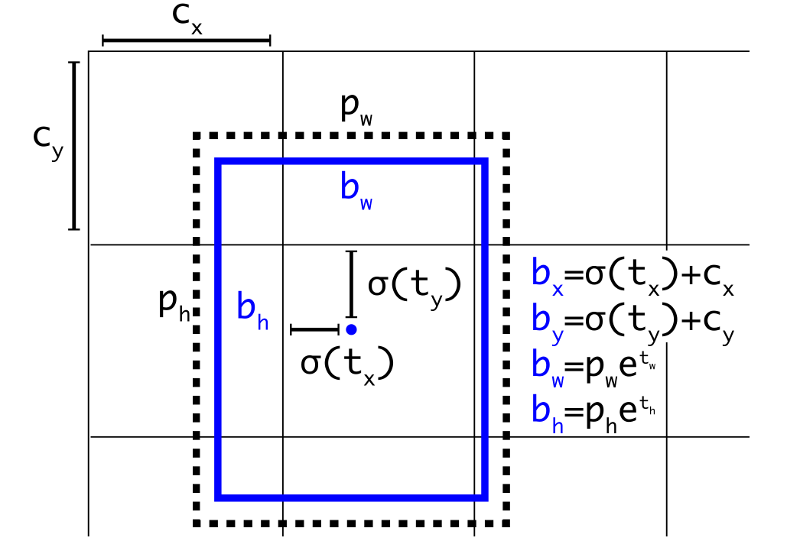
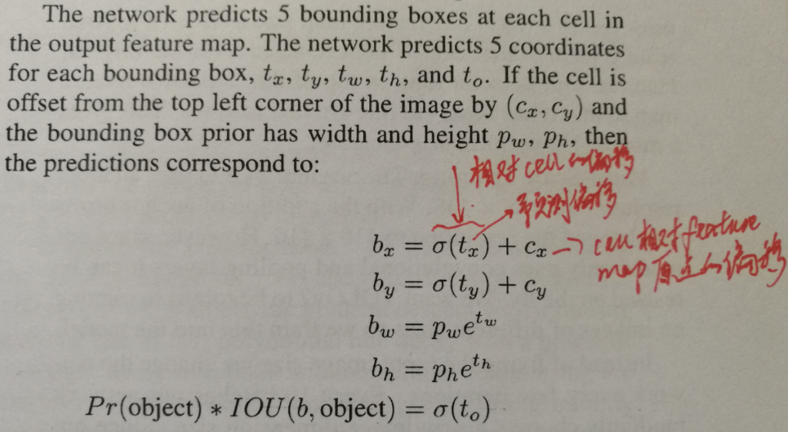

### 目标检测中的包围框回归
包围框回归公式都来自于R-CNN  
  
**用人话来说就是：**    



**对于YOLO系列，用YOLOv2来说，还是套用 R-CNN 的公式：**



### 简单介绍下NMS

 通常的做法是将检测框按得分排序，然后保留得分最高的框，同时删除与该框重叠面积大于一定比例的其它框。 

 NMS的阈值设小了会剔除与目标接近的其他目标，设置过高（有些框不能被剔除）又容易增大误检。 

NMS步骤如下：
- 1.设置一个Score的阈值，一个IOU的阈值；
- 2.对于每类对象，遍历属于该类的所有候选框，
- 3.过滤掉Score低于Score阈值的候选框；
- 4.找到剩下的候选框中最大Score对应的候选框，添加到输出列表；
- 5.进一步计算剩下的候选框与其中输出列表中每个候选框的IOU，若该IOU大于设置的IOU阈值，将该候选框过滤掉，否则加入输出列表中；
- 6.最后输出列表中的候选框即为图片中该类对象预测的所有边界框

```C
设置score阈值，设置IOU阈值
从类别C1~Cn中遍历类别：
    过滤分数低于score阈值的候选框
    遍历剩下的所有候选框：
    	找到score最大的候选框赋值给M，并移动到输出列表
    	计算剩下的候选框与输出列表中每个候选框的IOU
    	如果 IOU大于设置的IOU阈值，则：
    		将该候选框过滤掉
    	否则：
    		添加该候选框到输出列表
返回输出列表
```


改进版本[softNMS](https://www.cnblogs.com/zf-blog/p/8532228.html)

#### 推荐/参考链接


