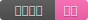


### 什么是 Markdown

Markdown 是一种方便记忆、书写的纯文本标记语言，用户可以使用这些标记符号以最小的输入代价生成极富表现力的文档：如您正在阅读的这篇文章。它使用简单的符号标记不同的标题，分割不同的段落，**粗体** 或者 *斜体* 某些文字.
很多产品的文档也是用markdown编写的，并且以“README.MD”的文件名保存在软件的目录下面。               
　　
### 一些基本语法  
#### *标题*
几级标题就在前面添加几个‘#’。  
`H1：# Header 1`   
# Header 1
`H3 :### Header 3`
### Header 3
`H5 :##### Header 5`     
##### Header 5 
#### *链接* :
```markdown
[链接显示的名称](https://jinbooooom.github.io)
```
[链接显示的名称](https://jinbooooom.github.io)        
#### *加粗* :\*\*Bold**
**Bold**  
#### *斜体字* :\*Italics*
*Italics*  
#### *删除线* :\~~text~~
~~text~~  
#### 段落 : 段落之间空一行           
#### 换行符 : 一行结束时输入两个空格           
#### 无序列表 :添加\* - + 成为一个新的列表项。  
```
* 新列表1  
- 新列表2  
+ 新列表3  
```
* 新列表1
- 新列表2
+ 新列表3

#### 引用 :\> 引用内容 
> 引用内容

#### 内嵌代码 : 

\`\`\`语言名 

代码  
\`\`\`
```python
def embed():
    print('Hello world')
```
```c
void embed()
{
    printf("Hello world");
}
```
### 字体
- 文字居中：
```HTML
<center> 居中</center>
```
<center> 居中</center>
#### 右对齐：
```HTML
<div style="text-align: right"> 右对齐 </div>
```
<div style="text-align: right"> 右对齐 </div>
#### 设置字体：
```HTML
<font color=red size=3 face="黑体">遇到新用法的时候再记录</font>
````
<font color=red size=3 face="黑体">遇到新用法的时候再记录</font>  

#### 表格
```markdown
| 左对齐 | 右对齐 | 居中对齐 |
| :-----| ----: | :----: |
| 单元格 | 单元格 | 单元格 |
| 单元格 | 单元格 | 单元格 |
```
| 左对齐 | 右对齐 | 居中对齐 |
| :-----| ----: | :----: |
| 单元格 | 单元格 | 单元格 |
| 单元格 | 单元格 | 单元格 |

#### Emoji: :panda_face: :sparkles: :camel: :boom: :pig:

[Emoji Cheat Sheet](http://www.emoji-cheat-sheet.com/)

#### Task list
```markdown
- [ ] a bigger project
  - [x] first subtask
  - [x] follow up subtask
  - [ ] final subtask
- [ ] a separate task
```

- [ ] a bigger project
  - [x] first subtask
  - [x] follow up subtask
  - [ ] final subtask
- [ ] a separate task

#### 可以跳转的图片标签
在网站[shields.io](https://shields.io/)生成需要的标签。
然后将显示图片的语法``，插入到链接语法`[链接描述](链接网址)` 的中括号内。如：  
`[](https://jinbooooom.github.io/)`  
[](https://jinbooooom.github.io/)
把图片标签设置居中    

```HTML
<p align="center">
  <a href="https://jinbooooom.github.io/"></a>
</p>
```
<p align="center">
  <a href="https://jinbooooom.github.io/"></a>
</p>

#### 数学公式

使用 Typora 显示数学公式。

- [Typora 常用公式的代码](https://blog.csdn.net/mingzhuo_126/article/details/82722455)
- [myscript](https://webdemo.myscript.com/views/math/index.html#)
- [mathcha](https://www.mathcha.io/)
### 链接：

[文字颜色、大小、字体与背景色的设置](https://blog.csdn.net/SimonITer/article/details/52249694)

### 推荐:  

#### 一些好用的 Markdown 编辑器  
- [Linux 上 10 个最好的 Markdown 编辑器](https://linux.cn/article-7623-1.html)

- [typora]()

- [MaHua](http://mahua.jser.me/?utm_source=mindstore.io) 在线 Markdown 编辑器 ,无须测试。  

- [MdEditor](https://www.mdeditor.com/) 渲染很不错，但与github有些不同。   

- [Markdown Plus](http://mdp.tylingsoft.com/) 一款 Markdown 编辑器，可以支持添加任务列表、emoji、流程图等。推荐。

  


