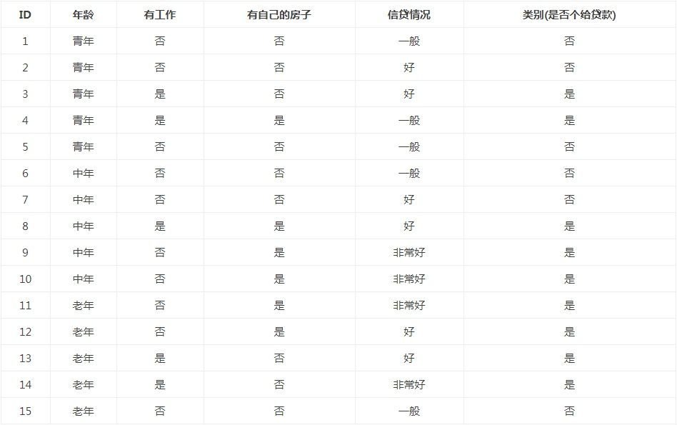
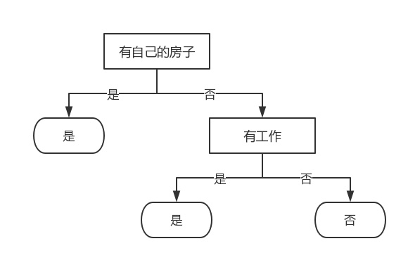

### 决策树概念

- 决策树是一种树形结构，其中每个内部节点表示一个属性上的判断，每个分支代表一个判断结果的输出，最后每个叶节点代表一种分类结果。
- 决策树是监督学习。
- 决策树学习算法包括3部分：特征选择、树的生成和树的剪枝。常用的算法有ID3、C4.5和CART。

### 决策树与LR

LR模型让所有的特征都学习，而决策树更像是编程语言里的 if-then规则的集合。

将决策树转换成if-then规则的过程是这样的：由决策树的根结点(root node)到叶结点(leaf node)的每一条路径构建一条规则；路径上内部结点的特征对应着规则的条件，而叶结点的类对应着规则的结论。决策树的路径或其对应的if-then规则集合具有一个重要的性质：互斥并且完备。这就是说，每一个实例都被一条路径或一条规则所覆盖，而且只被一条路径或一条规则所覆盖。这里所覆盖是指实例的特征与路径上的特征一致或实例满足规则的条件。

[L56]

### ID3 特征选择

以银行贷款申请为例，来理解决策树。

特征选择就是决定用哪个特征来划分特征空间。比如，我们通过上述数据表，用年龄或者是否有工作来划分，可以得到两个决策树，分别由这两个不同特征的根结点构成。

特征选择的目的在于选取对训练数据能够分类的特征。特征选择的关键是其准则。常用的准则如下：

（1）样本集合D对特征A的信息增益（ID3）
$$
g(D, A)=H(D)-H(D|A)
$$

$$
H(D)=-\sum_{k=1}^{K} \frac{\left|C_{k}\right|}{|D|} \log _{2} \frac{\left|C_{k}\right|}{|D|}
$$

$$
H(D | A)=\sum_{i=1}^{n} \frac{\left|D_{i}\right|}{|D|} H\left(D_{i}\right)
$$

其中，H(D)是数据集D的熵，H(D_i)是数据集D_i的熵，H(D|A)是数据集D对特征A的条件熵。

D_i是D中特征A取第i个值的样本子集，C_k是D中属于第k类的样本子集。n是特征A取 值的个数，K是类的个数。

（2）样本集合D对特征A的信息增益比（C4.5）
$$
g_{R}(D, A)=\frac{g(D, A)}{H(D)}
$$

其中，g(D,A)是信息增益，H(D)是数据集D的熵。

（3）样本集合D的基尼指数（CART）
$$
\operatorname{Gini}(D)=1-\sum_{k=1}^{K}\left(\frac{\left|C_{k}\right|}{|D|}\right)^{2}
$$
特征A条件下集合D的基尼指数：
$$
\operatorname{Gini}(D, A)=\frac{\left|D_{1}\right|}{|D|} \operatorname{Gini}\left(D_{1}\right)+\frac{\left|D_{2}\right|}{|D|} \operatorname{Gini}\left(D_{2}\right)
$$

### 决策树的生成

决策树的生成。通常使用信息增益最大、信息增益比最大或基尼指数最小作为特征选择的准则。决策树的生成往往通过计算信息增益或其他指标，从根结点开始，递归地产生决策树。这相当于用信息增益或其他准则不断地选取局部最优的特征，或将训练集分割为能够基本正确分类的子集。

### 递归创建决策树的终止条件

递归创建决策树时，递归有两个终止条件：第一个停止条件是所有的类标签完全相同，则直接返回该类标签；第二个停止条件是使用完了所有特征，仍然不能将数据划分仅包含唯一类别的分组，即决策树构建失败，特征不够用。此时说明数据纬度不够，由于第二个停止条件无法简单地返回唯一的类标签，这里挑选出现数量最多的类别作为返回值。

### 决策树的剪枝

决策树生成算法递归地产生决策树，直到不能继续下去为止。这样产生的树往往对训练数据的分类很准确，但对未知的测试数据的分类却没有那么准确，即出现过拟合现象。过拟合的原因在于学习时过多地考虑如何提高对训练数据的正确分类，从而构建出过于复杂的决策树。解决这个问题的办法是考虑决策树的复杂度，对已生成的决策树进行行剪枝，以简化学到的决策树。决策树的剪枝，往往从已生成的树上剪掉一些叶结点或叶结点以上的子树，并将其父结点或根结点作为新的叶结点，从而简化生成的决策树。

### 树形结构为什么不需要归一化？

因为数值缩放不影响分裂点位置，对树模型的结构不造成影响。 按照特征值进行排序的，排序的顺序不变，那么所属的分支以及分裂点就不会有不同。而且，树模型是不能进行梯度下降的，因为构建树模型（回归树）寻找最优点时是通过寻找最优分裂点完成的，因此树模型是阶跃的，阶跃点是不可导的，并且求导没意义，也就不需要归一化。

既然树形结构（如决策树、RF）不需要归一化，那为何非树形结构比如Adaboost、SVM、LR、Knn、KMeans之类则需要归一化。

对于线性模型，特征值差别很大时，运用梯度下降的时候，损失等高线是椭圆形，需要进行多次迭代才能到达最优点。 但是如果进行了归一化，那么等高线就是圆形的，促使SGD往原点迭代，从而导致需要的迭代次数较少。

### 决策树的优点

- 易于理解和解释。决策树可以可视化。
- 几乎不需要数据预处理。其他方法经常需要数据标准化，创建虚拟变量和删除缺失值。决策树计算复杂度不高，输出结果易于理解，对中间值的缺失不敏感，可以处理不相关特征数据。
- 使用树的花费（例如预测数据）是训练数据点(data points)数量的对数。
- 可以同时处理数值变量（比如说分数大于80的为优，剩下的再用其他特征做判断）和分类变量。其他方法大都适用于分析一种变量的集合。
- 可以处理多值输出变量问题。
- 使用白盒模型。如果一个情况被观察到，使用逻辑判断容易表示这种规则。相反，如果是黑盒模型（例如人工神经网络），结果会非常难解释。
- 即使对真实模型来说，假设无效的情况下，也可以较好的适用

### 推荐/参考链接

[机器学习实战教程（二）：决策树基础篇之让我们从相亲说起](https://cuijiahua.com/blog/2017/11/ml_2_decision_tree_1.html)

[决策树(Decision Tree)：通俗易懂之介绍](https://zhuanlan.zhihu.com/p/30059442)

[决策树及决策树生成与剪枝](https://blog.csdn.net/am290333566/article/details/81187562)

[机器学习-决策树](https://www.jianshu.com/p/65e69f4e0bce)

